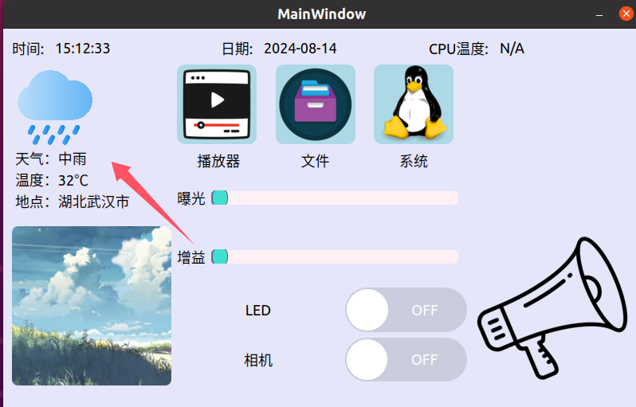
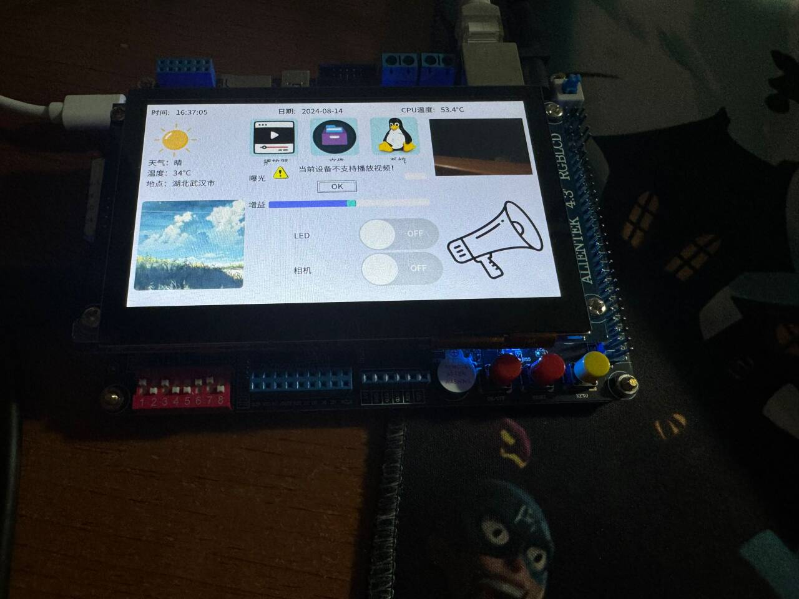

# 基于IMX6ULL设计的主控界面

效果展示图


实现基础功能：
天气预测，查看开发板系统文件，系统信息，视频播放器，相机控制，LED控制，蜂鸣器控制

# 项目目录

```bash
├── Img # 图片
├── Video # 待播放视频
├── Player # 视频播放器
├── FileApp # 文件管理
├── SystemInfo # 系统信息
├── Led # Led
├── Buzz # 蜂鸣器
├── Camera # 相机
├── Status # 状态栏
├── SwitchButton # 自定义开关
├── Weather # 天气
├── General.h 
├── General.cpp # 设置
├── mainwindow.h
├── mainwindow.cpp
├── mainwindow.ui
├── main.cpp
├── Imx6ull-Desktop.pro
└── res.qrc
```

# 天气功能

General.cpp中设置你的api

```c++
// Weather api
QString weatherApi =
    "your_api";
```

Weather.cpp配置你的http请求

```c++
void Weather::onFinished(QNetworkReply *reply)
{
    ...
}
```



# LED && 蜂鸣器

根据自己的开发板来

General.cpp中

```c++
QString ledModePath = "/sys/class/leds/sys-led/trigger";
QString ledBrightnessPath = "/sys/class/leds/sys-led/brightness";
QString buzzerPath = "/sys/class/leds/beep/brightness";
```

(长按喇叭蜂鸣器响)


# 状态栏

日期读取时间读取略，CPU温度读取的是

```c++
QString cpuTempPath = "/sys/class/thermal/thermal_zone0/temp";
```

这个文件

# 相机

相机使用v4l2框架（不是特别稳定）

我使用的相机的像素是yuyv格式，需要转化成rgb888，具体请看Camera文件夹

控制条重写了QSS样式，可控制相机的曝光和增益（ARM开发板下可能会出现问题，比较玄学）

# APP

app是使用QPushButton，偷了个懒，应该写一个单独的类继承QWidget，由于我的屏幕大小是固定的，所以对于APP的大小是200 * 200

## 播放器


使用的是QVideoWidget，实测再开发板上有问题，所以我关了arm的功能



## 文件


## 系统信息


# 移植

需交叉编译Qt和tslib移植到开发板上

# 引用

SwitchButton: https://github.com/xiezhongyuan/switchButton

Qtv4l2: https://github.com/Huge-Hammer/Linux-C-Coding/tree/main